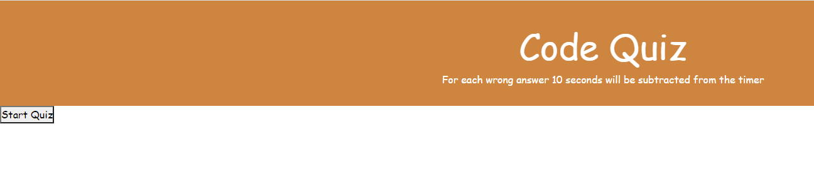
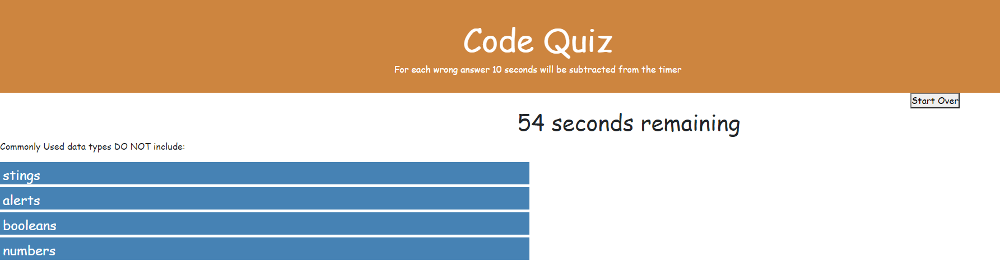
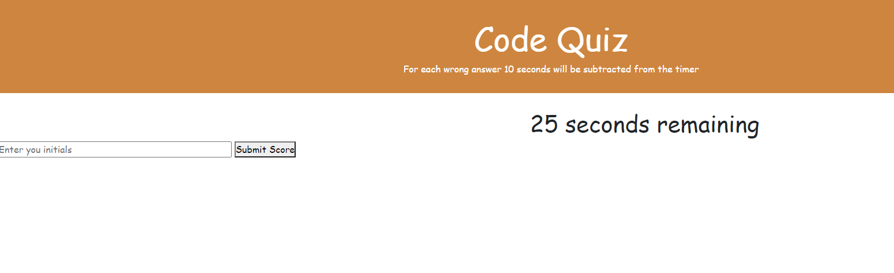
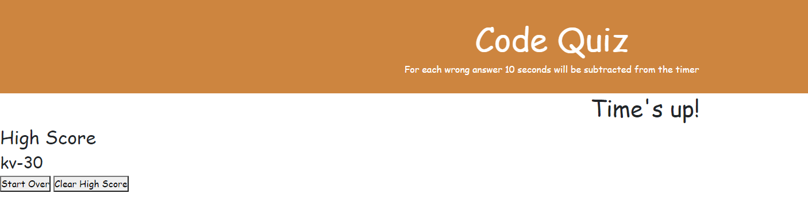

# Project Name: Code Quiz

## Summary

HTML and CSS and Javascript documents create a Code Quiz.
This project emphasizes the use of using Javascript to make dynamic changes to an HMTL document

## Description

When start button is clicked

then timer starts and user will be presented with a question

For wrong answer time is subtracted from the clock.
at the end of the quiz application will ask for user initial save it local storage.

High score will be displayed at the end of the game

## Link

https://kannavairavan.github.io/HW4_CodeQuiz/

## Repository

https://github.com/KannaVairavan/HW4_CodeQuiz.git

## Technologies

Visual Studio code, HTML5, CSS and Javascript
