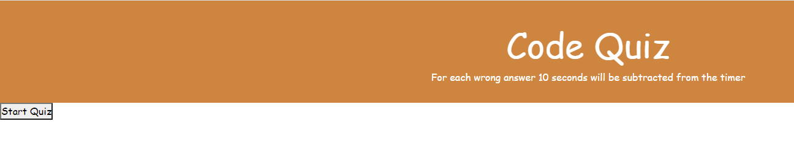
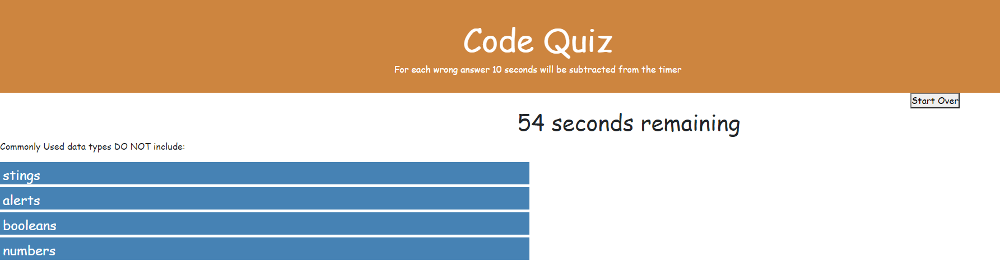

# Project Name: Code Quiz

## Summary

HTML and CSS and Javascript documents create a Code Quiz.
This project emphasizes the use of using Javascript to make dynamic changes to an HMTL document

## Description

When start button is clicked

then timer starts and user will be presented with a question

## Link

## Repository

## Technologies

Visual Studio code, HTML5, CSS and Javascript
